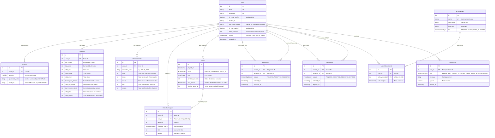

# 🏛️ Blueprint Database - ft_transcendence

Questo documento descrive lo schema ERD (Entity Relationship Diagram) aggiornato in base allo schema Prisma.

```mermaid
erDiagram
    %% --- ENTITÀ PRINCIPALI ---
    User {
        int id PK
        string email UK
        string username UK
        boolean is_email_verified "Default false"
        string avatar_url
        string two_factor_secret "Secret for 2FA (null if disabled)"
        boolean is_2fa_enabled "Default false"
        int token_version "Token version for invalidation"
        UserStatus status "ONLINE, OFFLINE, IN_GAME"
        timestamp created_at
    }

    Account {
        int id PK
        int user_id FK "User ID"
        Provider provider "LOCAL, GOOGLE"
        string password_hash "hashed password (null for OAuth)"
        string oauth_id "external Provider ID (null for LOCAL)"
    }

    UserStats {
        int id PK
        int user_id FK "User ID"
        int elo_current "Current ELO rating"
        int elo_peak "Personal ELO record"
        int total_wins "Total wins"
        int total_losses "Total losses"
        int total_draws "Total draws"
        int current_win_streak "Current consecutive wins"
        int best_win_streak "All-time best win streak"
        int current_lose_streak "Current consecutive losses"
        int total_kills "Total kills across all matches"
        int total_deaths "Total deaths across all matches"
    }

    CharacterStats {
        int id PK
        int user_id FK "User ID"
        string character_name "e.g. 'ZEUS', 'ADE'"
        int wins "Total wins with this character"
        int losses "Total losses with this character"
        int draws "Total draws with this character"
        int kills "Total kills with this character"
        int deaths "Total deaths with this character"
    }

    %% --- GAMEPLAY ---
    Match {
        int id PK
        timestamp played_at
        MatchMode mode "RANKED, UNRANKED, LOCAL, AI"
        MatchType type "FFA. TEAM"
        int duration_seconds "Match duration in seconds"
        EndReason end_reason "TIMEOUT, RESIGNATION, KILLOUT"
        int winning_team_id "Winning team ID (null for draw)"
		%% NOTE: For INDIVIDUAL and FFA modes all participants have a different teamID
    }

    MatchParticipant {
        int id PK
        int match_id FK "Match ID"
        int user_id FK "Player User ID (null for AI)"
		int team_id "Team ID"
        CharacterName character_name "Character used"
        int kills "Number of kills"
        int deaths "Number of deaths"
    }

    %% --- SOCIAL ---
    Friendship {
        int id PK
        int sender_id FK "Requester ID"
        int receiver_id FK "Receiver ID"
        FriendshipStatus status "PENDING, ACCEPTED, REJECTED"
        timestamp created_at
        timestamp updated_at
    }

    GameInvite {
        int id PK
        int sender_id FK "Inviter ID"
        int receiver_id FK "Invitee ID"
        InviteStatus status "PENDING, ACCEPTED, REJECTED, EXPIRED"
        timestamp created_at
        timestamp expires_at
    }

    %% --- GAMIFICATION ---
    Achievement {
        int id PK
        string name UK "Achievement Name"
        string description "Description"
        string icon_path "Icon path"
        AchievementType tier "BRONZE, SILVER, GOLD, PLATINUM"
    }

    UserAchievement {
        int id PK
        int user_id FK "User ID"
        int achievement_id FK "Achievement ID"
        timestamp unlocked_at "When unlocked"
    }

    %% --- NOTIFICATIONS ---
    Notification {
        int id PK
        int user_id FK "Recipient User ID"
        NotificationType type "FRIEND_REQ, FRIEND_ACCEPTED, GAME_INVITE, ACHV_UNLOCKED"
        string message "Notification text"
        boolean is_read "Default false"
        timestamp created_at
    }

    %% --- RELATIONS ---
    %% 1. Authentication & Statistics
    User ||--o{ Account : "has_accounts"
    User ||--|| UserStats : "has_stats"
    User ||--o{ CharacterStats : "has_stats_for"

    %% 2. Gameplay
    %% A Match CONTAINS 1 or more participants (Cardinality |{ )
    Match ||--|{ MatchParticipant : "includes_players"

    %% A User PLAYS in 0 or more participation records (Cardinality o{ )
    User ||--o{ MatchParticipant : "played_in"

    %% A User WINS 0 or more matches (Direct convenience relationship)
    User ||--o{ Match : "won_matches"

    %% 3. Social (Double relationship on the same table)
    User ||--o{ Friendship : "sent_friend_req"
    User ||--o{ Friendship : "received_friend_req"

    %% 4. Game Invites
    User ||--o{ GameInvite : "sent_invite"
    User ||--o{ GameInvite : "received_invite"

    %% 5. Gamification
    User ||--o{ UserAchievement : "earned"
    Achievement ||--o{ UserAchievement : "awarded_to"

    %% 6. Notifications
    User ||--o{ Notification : "receives"
```
