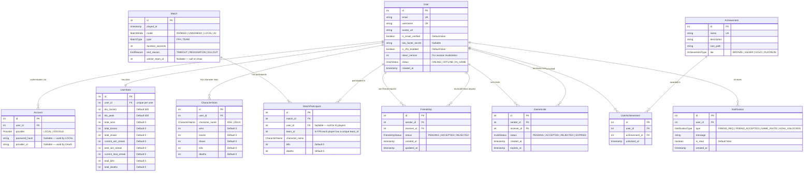

# Database Schema — ft_transcendence

Entity Relationship Diagram reflecting the final database design.

```mermaid
erDiagram
    %% ============ AUTHENTICATION ============
    User {
        int id PK
        string email UK
        string username UK
        string avatar_url
        boolean is_email_verified "Default false"
        string two_factor_secret "Nullable"
        boolean is_2fa_enabled "Default false"
        int token_version "For session invalidation"
        UserStatus status "ONLINE | OFFLINE | IN_GAME"
        timestamp created_at
    }

    Account {
        int id PK
        int user_id FK
        Provider provider "LOCAL | GOOGLE"
        string password_hash "Nullable — used by LOCAL"
        string provider_id "Nullable — used by OAuth"
    }

    %% ============ STATISTICS ============
    UserStats {
        int id PK
        int user_id FK "unique per user"
        int elo_current "Default 500"
        int elo_peak "Default 500"
        int total_wins "Default 0"
        int total_losses "Default 0"
        int total_draws "Default 0"
        int current_win_streak "Default 0"
        int best_win_streak "Default 0"
        int current_lose_streak "Default 0"
        int total_kills "Default 0"
        int total_deaths "Default 0"
    }

    CharacterStats {
        int id PK
        int user_id FK
        CharacterName character_name "ADE | ZEUS"
        int wins "Default 0"
        int losses "Default 0"
        int draws "Default 0"
        int kills "Default 0"
        int deaths "Default 0"
    }

    %% ============ GAMEPLAY ============
    Match {
        int id PK
        timestamp played_at
        MatchMode mode "RANKED | UNRANKED | LOCAL | AI"
        MatchType type "FFA | TEAM"
        int duration_seconds
        EndReason end_reason "TIMEOUT | RESIGNATION | KILLOUT"
        int winner_team_id "Nullable — null on draw"
    }

    MatchParticipant {
        int id PK
        int match_id FK
        int user_id FK "Nullable — null for AI players"
        int team_id "In FFA each player has a unique team_id"
        CharacterName character_name
        int kills "Default 0"
        int deaths "Default 0"
    }

    %% ============ SOCIAL ============
    Friendship {
        int id PK
        int sender_id FK
        int receiver_id FK
        FriendshipStatus status "PENDING | ACCEPTED | REJECTED"
        timestamp created_at
        timestamp updated_at
    }

    GameInvite {
        int id PK
        int sender_id FK
        int receiver_id FK
        InviteStatus status "PENDING | ACCEPTED | REJECTED | EXPIRED"
        timestamp created_at
        timestamp expires_at
    }

    %% ============ GAMIFICATION ============
    Achievement {
        int id PK
        string name UK
        string description
        string icon_path
        AchievementType tier "BRONZE | SILVER | GOLD | PLATINUM"
    }

    UserAchievement {
        int id PK
        int user_id FK
        int achievement_id FK
        timestamp unlocked_at
    }

    %% ============ NOTIFICATIONS ============
    Notification {
        int id PK
        int user_id FK
        NotificationType type "FRIEND_REQ | FRIEND_ACCEPTED | GAME_INVITE | ACHV_UNLOCKED"
        string message
        boolean is_read "Default false"
        timestamp created_at
    }

    %% ============ RELATIONSHIPS ============

    %% Authentication: each user can have multiple login methods
    User ||--o{ Account : "authenticates via"

    %% Statistics: one stats row per user, multiple per character
    User ||--|| UserStats : "has stats"
    User ||--o{ CharacterStats : "has character stats"

    %% Gameplay: matches have N participants, users play in N matches
    Match ||--|{ MatchParticipant : "has participants"
    User ||--o{ MatchParticipant : "participated in"

    %% Social: bidirectional friend requests and game invites
    User ||--o{ Friendship : "sent friend request"
    User ||--o{ Friendship : "received friend request"
    User ||--o{ GameInvite : "sent invite"
    User ||--o{ GameInvite : "received invite"

    %% Gamification: many-to-many through join table
    User ||--o{ UserAchievement : "unlocked"
    Achievement ||--o{ UserAchievement : "awarded to"

    %% Notifications
    User ||--o{ Notification : "receives"
```
